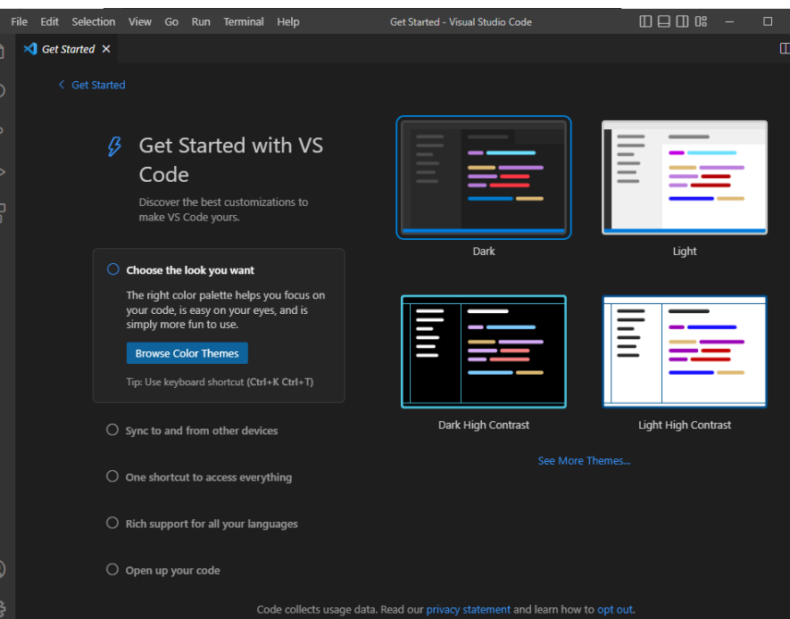
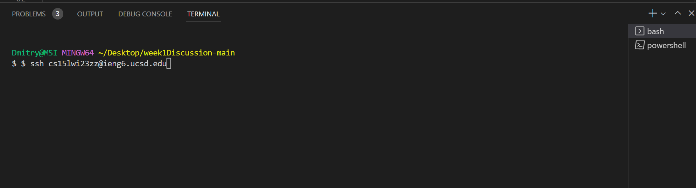
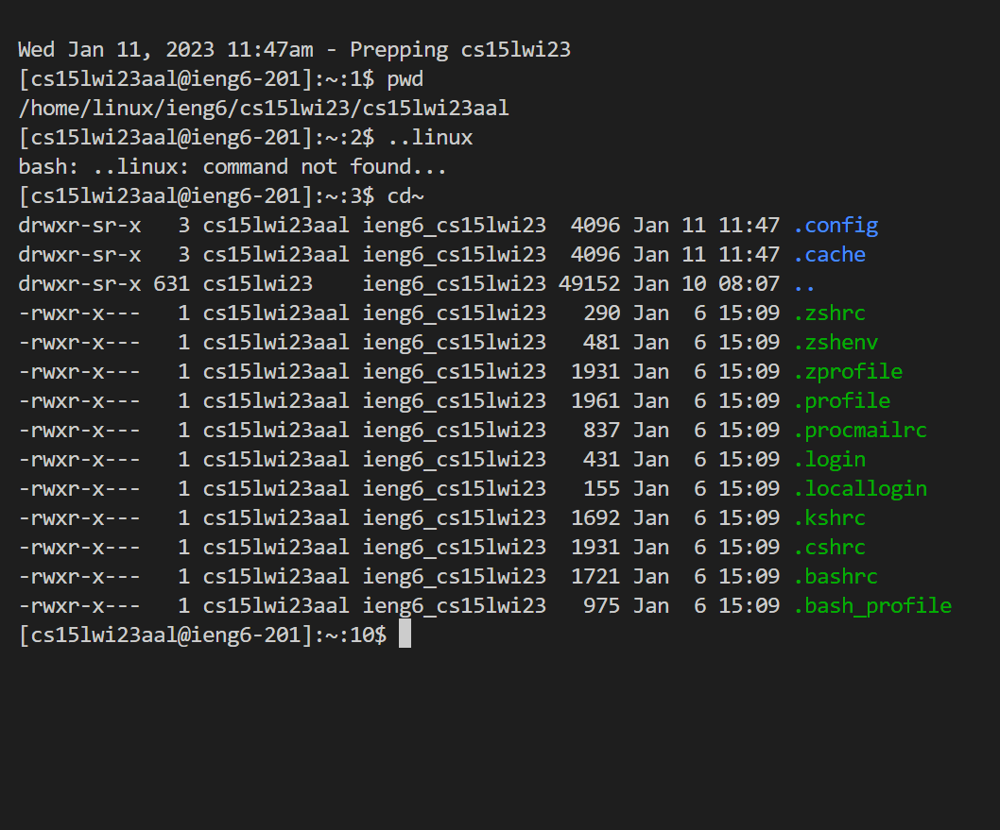

# CSE15L Setup Tutorial
*Hello, future CSE15L students! Welcoming to my tutorial of setting up VSCode, remotely connecting to the server, and trying out new commands! Let's begin.*
## Downloading VSCode:
To download VSCode refer to this link [VSCode](https://code.visualstudio.com/) and follow the instructions.
>As a result, when you open VSCode you will see something like this 

## Remotely Connecting
This step may take some time. **Firstly,** visit [Git Bash](https://gitforwindows.org/) to download git bash to your OS. **Secondly,** open the terminal in VSCode and apply  the _"bash"_ command shell at the right of the terminal. then type `$ ssh cs15lwi23zz@ieng6.ucsd.edu` in the terminal; however, make sure to replace zz with letters that appear in your username in order to connect to a course-specific `ieng6` account.
>It should look like this:
>

>Upon successfully logging in, you will see this message:
>

## Testing commands
>And make sure to test out some useful commands like:
- `cd`
- `pwd`
- `cat <path1> <path2>`
- `ls <path>`
>This is how it may look like in your terminal:
>

## Conclusion
Now you know how to setup VSCode, gitBash, remotely connect to a server and utilize commands. And don't forget to press `Ctrl+D` or type `exit` in the terminal to break the connection!
