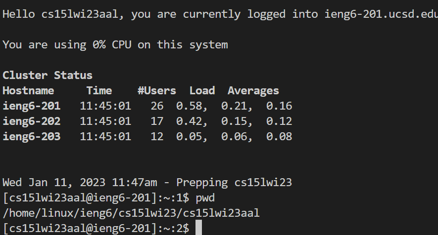

# CSE15L Setup Tutorial
*Hello, future CSE15L students! Welcoming to my tutorial of setting up VSCode, remotely connecting to the server, and trying out new commands! I will try to include detailed desxriptions of how to doit. Let's begin.*
## Downloading VSCode:
To download VSCode refer to this link [VSCode](https://code.visualstudio.com/) and follow the instructions. **Make sure to download the appropriate version for your OC!**
>As a result, when you open VSCode you will see something like this:
> 

## Remotely Connecting
This step may take some time. **Firstly,** visit [Git Bash](https://gitforwindows.org/) to download git bash to your OS. This will help you to connect to a remote server in your VSCode termianl usign the `ssh` command. **Secondly,** open the terminal in VSCode and apply  the _"bash"_ command shell at the right of the terminal. then type `$ ssh cs15lwi23zz@ieng6.ucsd.edu` in the terminal; however, make sure to replace zz with letters that appear in your username in order to connect to a course-specific `ieng6` account.
>It should look like this:
>

>**Keep in mind that you will get this message when trying to log in for the first time:**
>

Don't worry, that's supposed to happen. Just press `yes` to continue and type in your password.
>Upon successfully logging in, you will see this message:
>

After successfully logging in, you are now able to test various commands that you've learned.(Notice that it shows when you logged in and how many users are currently on the server)
## Testing commands
>And make sure to test out some useful commands like:
- `cd`- changes the current directory.
- `pwd`- prints the current working directory (full path to the current directory).
- `cat <path1> <path2>` - shows the contents of the files.
- `ls <path>`- lists all the files in the current directory (except hidden files).
>This is how it may look like in your terminal:
>

>You can observe the effects of the differenct commands I ran, for example:
>
1. pwd - printed my working directory on the ieng6 serever.
2. ls - listed all the files in my current directory `cse15lwiaal` the directories `perl5` and `wavelet`.
3. cd wavelet - changed the current directory to be `wavelet`.
4. ls wavelet - listed the .class and .java files in the directory; then I compiled and ran Server.java (there was no main method in Server.java, so the output was an error).
5. cat Server.java - simply printed the text of the file Server.java (a part of it can be seen in the screenshot).
## Conclusion
Now you know how to setup VSCode, gitBash, remotely connect to a server and utilize commands. Make sure to test out those and many other ones that you will be taught during the quarter! And don't forget to press `Ctrl+D` or type `exit` in the terminal to break the connection!
