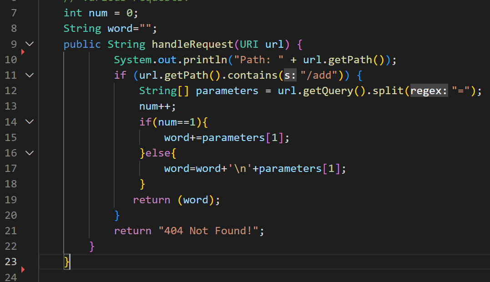

# CSE15L LabReport2
_Hello, today I will show how to setup a server StringServer, some JUnit tests, as well as share what things I learnt during Lab1 and Lab3!_
## Part1
For this part I have coded a server StringServer, which concatenates strings to each other, which are being inputted in the query of the server.
> The screenshot with the code that successfully implements the task:

