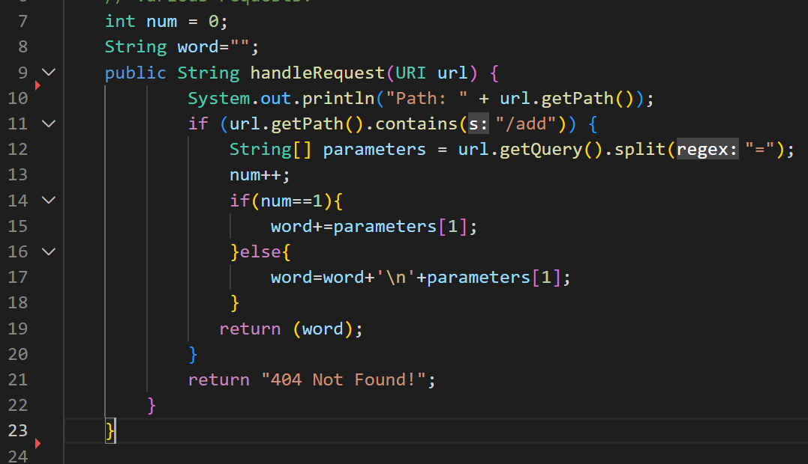

# CSE15L LabReport2
_Hello, today I will show how to setup a server StringServer, some JUnit tests, as well as share what things I learnt during Lab1 and Lab3!_
## Part1
For this part I have coded a server StringServer, which concatenates strings to each other, which are being inputted in the query of the server.
> **The screenshot with the code that successfully implements the task and explanation for each line:**

- _line 11 checks if the path of the inputted URL contains `/add`; if **true**, then goes inside the if-statement; if **false**, returns `404 not found`_
- _line 12 gets the string(query) after the `=` sign_
- _lines 14 to 18 concatenate the inputted strings to each other_
- _line 19 returns the result_

> **The screenshots of the actual outputs:**

_Here I called the method `handleRequest` in `Handler` class that takes a URI as an input. By adding `Hello` in the query in my code I changed the variable `word`, which I declared to be empty unless there is an input in the query. So, by the time `return word` line in my code ran, word was equal to "Hello" (word = Hello)._

_By adding `How are you` to the query, nothing in my code changed, but the counter variable int num (which became **num++**) and the String word, to which **"How are you"** was concatenated. _
