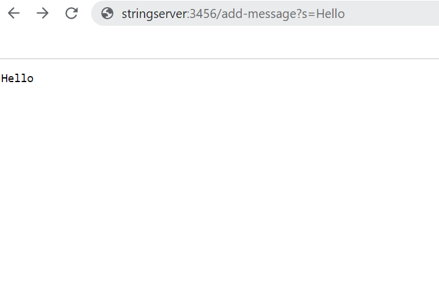

# CSE15L LabReport2
_Hello, today I will show how to setup a server StringServer, some JUnit tests, as well as share what things I learnt during Lab1 and Lab3!_
## Part1
For this part I have coded a server StringServer, which concatenates strings to each other, which are being inputted in the query of the server.
> **The screenshot with the code that successfully implements the task and explanation for each line:**


- _line 11 checks if the path of the inputted URL contains `/add`; if **true**, then goes inside the if-statement; if **false**, returns `404 not found`_
- _line 12 gets the string(query) after the `=` sign_
- _lines 14 to 18 concatenate the inputted strings to each other_
- _line 19 returns the result_

> **The screenshots of the actual outputs:**


*** 
_Here I called the method `handleRequest` in `Handler` class that takes a URI as an input. By adding `Hello` in the query in my code I changed the variable `word`, which I declared to be empty unless there is an input in the query. So, by the time `return word` line in my code ran, word was equal to "Hello" (word = Hello)._
***

***
_By adding `How are you` to the query, nothing in my code changed, but the counter variable int num (which became **num++**) and the String word, to which **"How are you"** was concatenated._

## Part2
**REVERSE IN PLACE method:**

**Buggy Program:**
```
static void reverseInPlace(int[] arr) {
    for(int i = 0; i < arr.length/2; i++) {
      arr[i]=arr[arr.length - i - 1]
    }
```
This program is **BUGGY!!!**. Let's figure put what the problem is and test it.

**Not a failure inducing input:**
```
public void testReverseInPlace() {
    int[] input1 = {3};
    ArrayExamples.reverseInPlace(input1);
    assertArrayEquals(new int[]{3}, input1);
	}
```
_For reverse in place method, the input of {3} didn’t cause an issue because it’s a single element but things start to get tricky when the user adds more._

**One of the failure-inducing inputs (JUnit test):**
```
public void testReverseInPlace() {
    int[] input1 = {1,2,3,4,5};
    ArrayExamples.reverseInPlace(input1);
    assertArrayEquals(new int[]{5,4,3,2,1}, input1);
	}
```
 The failure inducing inputs are arrays of length>1 and the bug is that the method overwrites the elements at specific indexes. Example: {1,2,3} would return {3,2,3} instead of {3,2,1} because when the third element tries to be swapped with the first element, it swaps, but the first element is already the third element, which in our case is 3. So, to fix the bug we just have store the values of the array in a specific variable in our case `tmp`.
 ***
**The symptoms after both the failiure-inducing input:**

***
**And non failure-inducing input:**

***

**The CORRECT program that fixes all the bugs and doesn't show any symtoms:**
```
 static void reverseInPlace(int[] arr) {
    int tmp=0;
    for(int i = 0; i < arr.length/2; i++) {
      tmp=arr[i];
      arr[i] = arr [arr.length - i - 1];
      arr[arr.length-i-1]=tmp;
    }
  }
```
So, what fixes the bug here is that we replace the elements in the array like in the **BUGGY** program, but first we allocate a variable to store the initial element.
