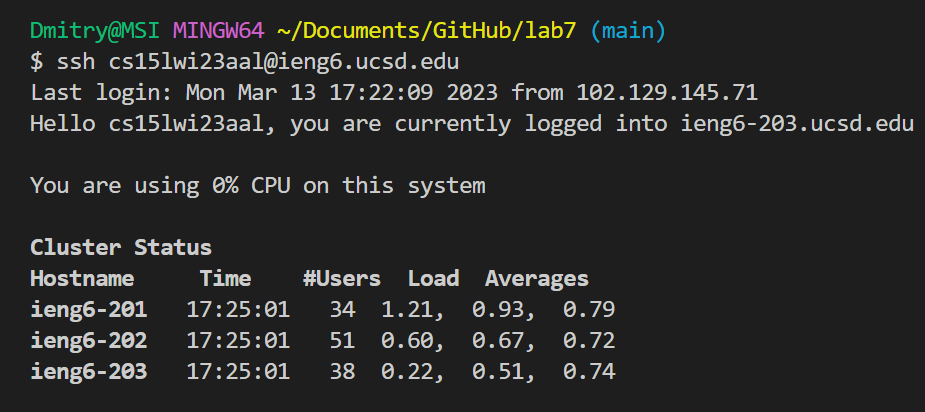

# CSE15L Lab Report 4
***
During the lab, we learned how to speed up working with the command line, making it more efficient and easy to use. We practised performing several command line tasks and timed ourselves to see who would accomplish them more efficiently. The following is a brief guide to optimizing the time spent on writing bash commands in the terminal. I will be going over some tips and tricks that I, personally, used to finish the lab tasks as fast as possible with no errors. In my Lab Report I will include screenshots and details of my work with the commad line. Additionally, I will mention some shortcuts that sped up the process for me
***
## Logging into ieng6
***
In this part of the assignment I logged into into ieng6 using `<ssh>` command and utilizing `<up>` arrow.

.

**Keys pressed**: `<up>`, `<up>`, `<enter>`.

`ssh cs15lwi23aal@ieng6.ucsd.edu` was the **second** command in my search history, that's why I pressed `<up>` 2 times before entering the ecommand using `<enter>`
***
