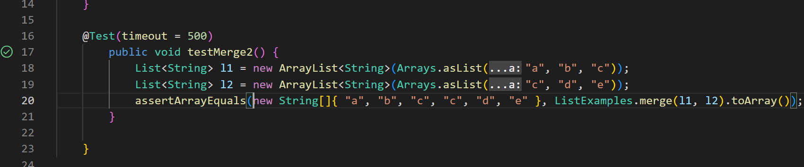

# CSE15L Lab Report 4
***
During the lab, we learned how to speed up working with the command line, making it more efficient and easy to use. We practised performing several command line tasks and timed ourselves to see who would accomplish them more efficiently. The following is a brief guide to optimizing the time spent on writing bash commands in the terminal. I will be going over some tips and tricks that I, personally, used to finish the lab tasks as fast as possible with no errors. In my Lab Report I will include screenshots and details of my work with the commad line. Additionally, I will mention some shortcuts that sped up the process for me.
***
## Logging into ieng6
***
In this part of the assignment I logged into into ieng6 using `<ssh>` command and utilizing `<up>` arrow.

.

**Keys pressed**: `<up>`, `<up>`, `<enter>`.

`ssh cs15lwi23aal@ieng6.ucsd.edu` was the **second** command in my search history, that's why I pressed `<up>` 2 times before entering the ecommand using `<enter>`

**NOTE**: this would have taken more time if I typed my username without using the `<up>` arrow. Moreover, if I hadn't generated an `ssh` key for GitHub during the lab, I would have been asked to type in my password, which would slow the process down. 
***
## Cloning my fork of the repository from GitHub
***
In this part of the assigment I cloned the *lab7* repository that had already been forked by me by utilizing `git clone` command. I had to refresh my knowledge about git commands in the command line, so I used `git --help` command, which reminded me that  `git clone` clones the repository. So, I copied the link for the repositiry in my GitHub account and cloned the repo into my **ieng6** account.

**Keys pressed**: `<Ctrl + C>` the link of repo, `<git --help>`, `<git clone + right click of mouse>` - paste link, `<enter>`

***
## Running tests and demonstarating they fail
***
For this task, I ran `javac -cp .:lib/hamcrest-core-1.3.jar:lib/junit-4.13.2.jar *.java` and `java -cp .:lib/hamcrest-core-1.3.jar:lib/junit-4.13.2.jar org.junit.runner.JUnitCore ListExamplesTests` one after another, while using bash history.

**Keys pressed**: `<up>`,`<up>`,`<up>`,`<up>`,`<up>`,`<enter>` and `<up>`,`<up>`,`<up>`,`<up>`, `<enter>`
`javac -cp .:lib/hamcrest-core-1.3.jar:lib/junit-4.13.2.jar *.java` and `java -cp .:lib/hamcrest-core-1.3.jar:lib/junit-4.13.2.jar` command was 5 up in the search history so I used up arrow to access it. `java -cp .:lib/hamcrest-core-1.3.jar:lib/junit-4.13.2.jar org.junit.runner.JUnitCore ListExamplesTests` was 4 up in the history so I used up arrow to access it 4 times. At the end, I got an error message, which demonstartes that test in *ListTestsExamples.java* fail.

***
## Editing code
***
In this part of the challenge I figured out that the problems with the code were in *ListExamples.java* on line 42, because indexes were not correct. I changed that line to be `index2+=1` instead of `index1+=1`.

***
## Running tests that now succeed
***
As can be seen the test that failed before, now has no errors.

***
## Pushing
***
This part confused me, because I was not able to push the changes. Commands like `git add --all` and `git commit -m` were fine, however `git push` resulted in this error message.

Despite that, I succesfully commited and pushed changes through **GitHub Desktop**. I will ask a tutor why `git push` results in an error and fix it.
***
## Conclusion

That's all I wanted to share with regarding working with the command line, using shortcuts, auto completion to optimize working with in bash terminal.
