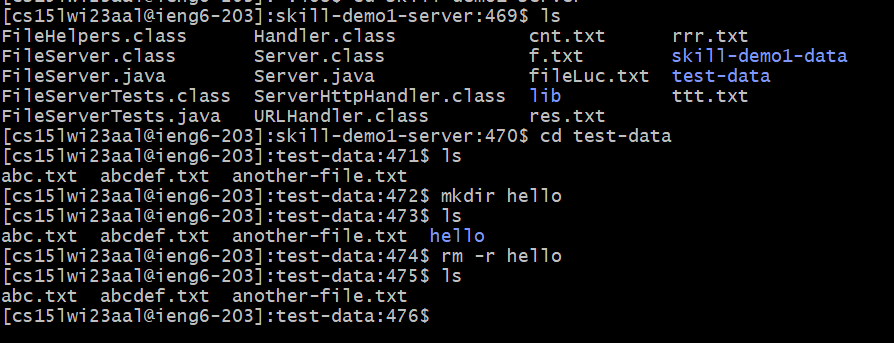
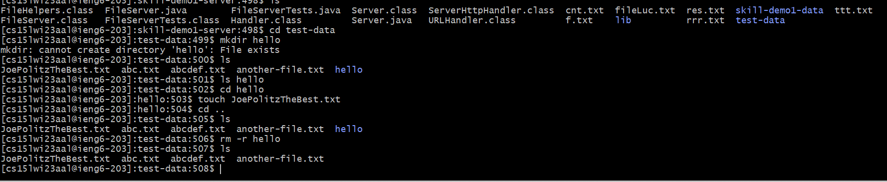
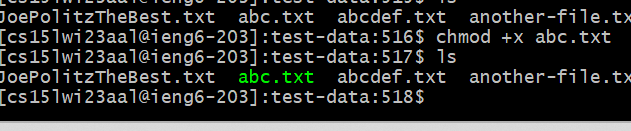
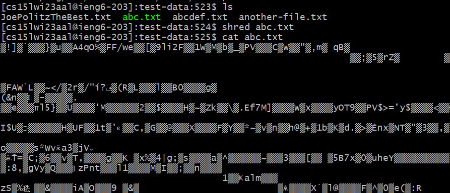

# CSE15L Lab Report 5
***
The lab activity that I liked the most definetely was testing out various bash commands. In my **Lab Report 3** I researched **`<grep>`** and **`<find>`** commands; however, in this **Lab Report 5** I plan to cover more interesting and useful bash commands. Let's begin!
***
## rm
One can use the `<rm>` command to remove files or directories. But one of the issues with it, is that you have to be very careful when using to delete files or directories for the most part, because it's nearly impossible to gain access to the removed files back. The code snippet below is one example of using this command.
```
$ ls
'Screenshot (10).png'  'Screenshot (30).png'  'Screenshot (53).png'
'Screenshot (11).png'  'Screenshot (31).png'  'Screenshot (54).png'
$ touch hello.png
$ ls
'Screenshot (10).png'  'Screenshot (30).png'  'Screenshot (53).png'
'Screenshot (11).png'  'Screenshot (31).png'  'Screenshot (54).png'
'hello.png'
$ rm hello.png
$ ls
'Screenshot (10).png'  'Screenshot (30).png'  'Screenshot (53).png'
'Screenshot (11).png'  'Screenshot (31).png'  'Screenshot (54).png'
```
***
If one wants to delete an empty directory the recursive **<-r>** flag could be used. The picture below is an example, while logged in into the **ieng6** course account:



However, when trying to delete a directory that's not empty the **<-rf>** flag is used. Let's add a file into our `hello` directory and try to use **`<rm -r>`** on it and see what happens and then use **`<rm -rf>`**:



Actually, I was very surprised with the results when testing **`<rm -r>`** on a full directory **hello** with **JoePolitzTheBest.txt** file. I expected to see some error that would say that **`<rm -r>`** cannot be used on **hello**; however, what happened is that **hello** directory got deleted but the file **JoePolitzTheBest.txt** was not as seen by the results of **`ls`** command above. But, when I use **`<rm -rf>`** on **hello**, both the directory and it contents get deleted as shown in the code snippet below:
```
[cs15lwi23aal@ieng6-203]:test-data:508$ mkdir hello
[cs15lwi23aal@ieng6-203]:test-data:509$ ls
JoePolitzTheBest.txt  abc.txt  abcdef.txt  another-file.txt  hello
[cs15lwi23aal@ieng6-203]:test-data:510$ cd hello
[cs15lwi23aal@ieng6-203]:hello:511$ touch absssc.txt
[cs15lwi23aal@ieng6-203]:hello:512$ cd ..
[cs15lwi23aal@ieng6-203]:test-data:513$ ls
JoePolitzTheBest.txt  abc.txt  abcdef.txt  another-file.txt  hello
[cs15lwi23aal@ieng6-203]:test-data:514$ rm -rf hello
[cs15lwi23aal@ieng6-203]:test-data:515$ ls
JoePolitzTheBest.txt  abc.txt  abcdef.txt  another-file.txt --> there is neither hello nor absssc.txt in the current working directory.
```
***
This command **`<rm>`** is simple but can be a little bit tricky as shown in the examples above. And be careful not to delete all of your work by accidentally using **`<rm -rf>`** instead of **`<rm -r>`** on a full directory!

## chmod
The chmod command lets you change the permissions of a certain file. So, what are permission to begin with? Permission state what the user can do with a file: either read, write or execute. For this command the flags are:
```
<+r> (read)
<+w> (write)
<+x> (execute)
```
Let's try to make a file executable by user. To do this, I can type chmod and +x and then the file you want to modify permissions on, for example:



As you can see in *git bash* a file, which is of **executable** type permission is colored in green. After researching this command, I have found it to be very informative and useful, because, to be honest, before I didn't know that file had three types of permission.

## ps
Another command that I've never heard of before is **`<ps>`**. With this command, you can check which process the current shell session is running at the moment. It prints useful information about programs that are running. In my case, it printed this:
```
[cs15lwi23aal@ieng6-203]:test-data:520$ ps
  PID TTY          TIME CMD
 9607 pts/188  00:00:00 ps
15688 pts/188  00:00:00 bash
```
That's a new command that I've found interesting and that has never been discussed during lectures.

## shred
Final command that I found really cool was **`<shred>`**. This command overrides the contents of a file multiple times, so the contents of the file become difficult (almost impossible) to recover. The result of using this command on **abc.txt** is below:



This looks very creepy but **`<shred>`** is very useful in terms of file security. And from what I've read on the internet, it's better to overwrite the data multiple times than to simply delete it. So, even if someone wants to steal the data from the file, it wouldn't be possible because now the data of the file is basically encrypted and almost impossible to recover.
